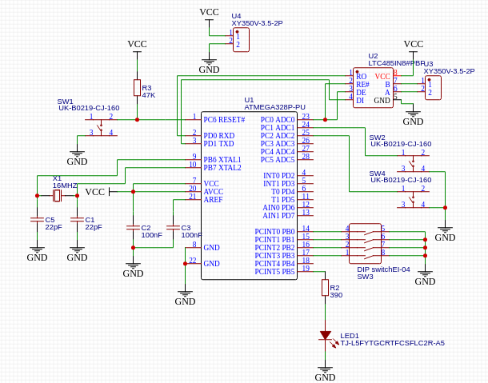
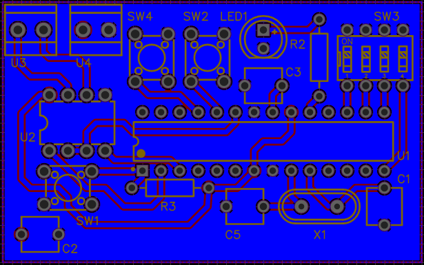

# Sele485
A USART master-slave setup for the Atmega328p through a differencial communication, the LTC485. Uses 9bit, 1 stop bit and odd parity and Multi-processor communication mode (MPCM). Includes a printable PCB and code.

# PCB
Includes an ATmega328p, an LTC485, a crystal oscillator clock, 4 switches, 2 buttons, and some external ports as screwable wire ports. It is seen in the next schematic designed in EasyEDA.



The PCB that was produced from it:



# Code Implementation
```c
void transmit(uint8_t isAddress, uint8_t data);
```
Waits for the "USART Data Register Empty" bit to be true and sets 9th bit to either 1 (if packet is an address) or 0 (if packet is data), and remaining bits to UART buffer.

```c
uint8_t receive(){
```
Waits for the "USART Receive Complete" bit to be true and set received data to a global variable (rxData) and returns whether if received an address or data frame.

```c
void initUSART(uint32_t baud, uint8_t isTX){
```
Sets baud rate, 9-bit dataframe, 1 stop bit and parity, in case of slave, turns on Multi-Processor Communication Mode. Being TX means being a master and not being TX means being a slave.

```c
void setup(){
```
Sets needed pins for pullup and sets led pin and tx line to outputs. Reads address of switches and sends result to previous function. Stores address in global variable.

```c
void slaveLoop(){
```
Infinite loop that waits to receive a message. If message is an address, and if the address received matches the receiver, the receiver disables MPCM to wait for a data frame. If message is data, knowing it will only arrive if the receiver has been addressed before, it will either set or clear the pin of the led.

```c
void masterLoop(){
```
Infinite loop that polls for a pin value change in the button pins. When one is detected, an address frame is sent to the button that represents the slave, and a data frame to either turn on or off the led.

